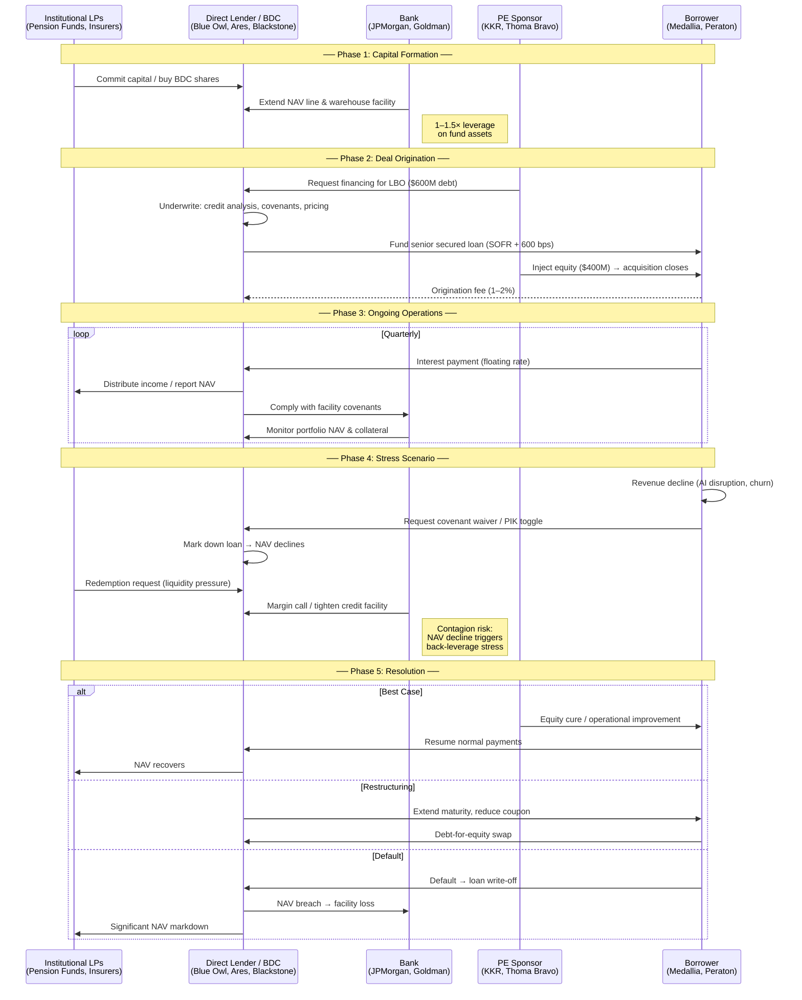

# Private Credit: Business Process & Ecosystem

## Overview

Private credit is a form of non-bank lending where institutional investors (direct lenders) provide debt financing directly to companies — typically mid-market, PE-backed businesses — outside of the traditional syndicated loan or public bond markets. Banks play a supporting role by providing leverage facilities to the lenders themselves.

The ecosystem has three primary layers:

| Layer | Who | Role |
|-------|-----|------|
| **Lenders** | BDCs, direct lending funds, credit arms of PE firms | Originate and hold private loans |
| **Borrowers** | PE-backed companies, mid-market corporates | Receive debt financing for operations, acquisitions, LBOs |
| **Banks** | Large investment / commercial banks | Provide back-leverage (warehouse lines, NAV facilities) to lenders |

---

## The Three Participants

### Lenders (Direct Lending Funds / BDCs)

Examples: Blue Owl Capital, Ares Management, Blackstone Credit, Apollo Global, KKR Credit

These are asset managers or Business Development Companies (BDCs) that raise capital from institutional investors (pension funds, insurance companies, endowments, family offices, retail via BDC structures) and deploy it as private loans.

**How they make money:**
- Spread income — charge borrowers a floating rate (e.g., SOFR + 500–700 bps)
- Origination fees — upfront fee (1–2%) at deal close
- Management & performance fees — charged to LPs in the fund

**Key risks:**
- Credit deterioration of borrowers → markdowns, impairments
- Redemption pressure from LPs wanting liquidity
- Covenant waivers that weaken lender protections
- PIK (payment-in-kind) toggle — borrower defers cash interest, paying in additional debt instead

### Borrowers (PE-Backed Companies)

Examples: Medallia, Peraton, Zendesk, Informatica, Epicor, Cloudera

These are typically companies acquired by private equity sponsors through leveraged buyouts (LBOs). The PE firm acquires the company using a mix of equity (30–40%) and debt (60–70%), where the debt comes from private credit lenders.

**Why they borrow from private credit (vs banks/bonds):**
- Speed and certainty of execution (one lender vs syndicate)
- Flexibility in deal structuring
- Willingness to lend to companies that may not qualify for investment-grade bonds
- Confidentiality (no public disclosure requirements)

**Key risks:**
- High leverage ratios (5–7× EBITDA) leave thin margin for error
- Maturity walls — large chunks of debt coming due in 2026–2027
- Revenue/customer disruption (e.g., AI disruption for legacy software companies)
- Default or restructuring if cash flow cannot service floating-rate debt

### Banks (Back-Leverage Providers)

Examples: JPMorgan Chase, Goldman Sachs, Morgan Stanley, Barclays, Wells Fargo

Banks don't typically hold private credit loans on their own books. Instead, they provide **leverage to the lenders** — essentially lending to the lenders so the lenders can make more loans. This is called **back-leverage**.

**Forms of bank involvement:**
- **NAV credit facilities** — loans to BDCs secured by their portfolio NAV
- **Warehouse lines** — revolving credit lines used by funds to warehouse loans before securitization
- **Subscription lines** — short-term facilities backed by LP commitments
- **CLO structuring** — banks arrange collateralized loan obligations that bundle private loans

**Key risks:**
- Contagion — if borrower defaults cascade, lender portfolios lose value, and bank collateral (the lender's NAV) declines
- Margin calls — banks may require lenders to post additional collateral
- Credit pullback — banks reduce or withdraw leverage facilities, forcing lenders to de-lever

---

## End-to-End Business Process

### Phase 1: Capital Formation

1. **LP → Lender:** Institutional investors (LPs) commit capital to a private credit fund or buy shares of a publicly traded BDC.
2. **Bank → Lender:** Banks extend NAV lines and warehouse facilities to the lender, amplifying their lending capacity (typically 1–1.5× leverage on the fund).

### Phase 2: Deal Origination & Lending

3. **PE Sponsor identifies target:** A private equity firm finds a company to acquire (e.g., a mid-market software company doing $200M revenue).
4. **PE Sponsor structures LBO:** $1B acquisition = $400M equity + $600M private credit debt.
5. **Lender underwrites the loan:** The direct lender (or a club of 2–3 lenders) provides $600M in senior secured floating-rate debt at SOFR + 600 bps.
6. **Loan closes:** Borrower receives funds, PE sponsor completes acquisition. Lender earns a 1.5% origination fee ($9M).

### Phase 3: Ongoing Operations

7. **Borrower services debt:** Quarterly interest payments at the floating rate. If rates rise, the borrower's interest burden increases.
8. **Lender monitors covenants:** Leverage ratio, interest coverage, minimum EBITDA — if breached, lender can accelerate repayment or renegotiate.
9. **Lender reports to LPs:** NAV is calculated quarterly based on fair value of the loan portfolio. Distributions are paid from interest income.
10. **Bank monitors collateral:** The bank tracks the lender's portfolio NAV. If NAV drops below thresholds, margin calls may be triggered.

### Phase 4: Stress Scenario (What the Analyzer Detects)

11. **Borrower revenue declines** (e.g., AI disruption, customer churn) → cash flow shrinks → interest coverage ratio deteriorates.
12. **Borrower requests covenant waiver** or switches to PIK (deferring cash interest) → lender's income quality degrades.
13. **Lender marks down the loan** → fund NAV declines → LP redemption requests increase.
14. **Bank reacts to NAV decline** → may issue margin calls, tighten facility terms, or pull back credit lines.
15. **Contagion risk:** If multiple borrowers stress simultaneously, the lender may face liquidity pressure from both sides — LPs pulling out and banks pulling leverage.

### Phase 5: Resolution

16. **Best case:** Borrower refinances, revenue recovers, covenant cure via equity injection from PE sponsor.
17. **Moderate case:** Loan is restructured — maturity extended, coupon reduced, debt-for-equity swap.
18. **Worst case:** Borrower defaults → lender writes off the loan → NAV drops sharply → bank takes loss on leverage facility → broader market contagion.

---

## Swimlane Diagram



---

## Signal Mapping: What Each Layer's Scores Capture

### Lender Signals

| Signal | Polarity | What It Means |
|--------|----------|---------------|
| Spread Power | Positive | Lender can charge wider spreads — pricing power in origination |
| Fundraise Resilience | Positive | Successfully raising new capital despite volatility |
| NAV Stability | Positive | Portfolio quality maintained, no material markdowns |
| Covenant Tightening | Positive | Strengthening borrower protections — favorable position |
| Redemption Pressure | Negative | LPs requesting withdrawals — liquidity stress |
| NAV Markdown | Negative | Portfolio devaluation, impaired loans |
| Covenant Waiver | Negative | Granting borrower relief — weakened position |
| PIK Stress | Negative | Borrowers deferring cash interest — income quality risk |
| Fee Compression | Negative | LP pressure reducing management/performance fees |

**Terms Power Score** = How much positive signal vs total signal. High score → strong position.

### Borrower Signals

| Signal | Polarity | What It Means |
|--------|----------|---------------|
| Revenue Growth | Positive | Company maintaining or growing revenue — can service debt |
| Refinancing Success | Positive | Successfully extending or renewing debt facilities |
| AI Disruption Risk | Negative | Core business threatened by AI competition / pricing erosion |
| Maturity Wall | Negative | Large debt maturing in 2026–2027 with uncertain refinancing |
| Default Risk | Negative | Missed payments, covenant breaches, restructuring signals |
| Customer Churn | Negative | Revenue declining from customer loss or pricing pressure |

**Stress Score** = 100 − Terms Power. High score → heavy distress signal relative to resilience.

### Bank Signals

| Signal | Polarity | What It Means |
|--------|----------|---------------|
| Market Share Gain | Positive | Bank expanding its private credit financing business |
| Credit Pullback | Negative | Bank reducing or withdrawing back-leverage facilities |
| Margin Call | Negative | Bank demanding additional collateral from lenders |
| Contagion Risk | Negative | Bank exposed to cascading losses from private credit |

**Net Position** = Positive mentions − Negative mentions. Positive → gaining share; Negative → pulling back or exposed.

---

## The Flywheel of Stress

The three layers are interconnected in a feedback loop:

```
Borrower stress (revenue ↓, default risk ↑)
        │
        ▼
Lender stress (markdowns ↑, covenant waivers ↑, PIK ↑)
        │
        ▼
LP redemptions ↑  ←─────────────────────┐
        │                                │
        ▼                                │
Lender forced to de-lever               │
        │                                │
        ▼                                │
Bank stress (margin calls, pullback)    │
        │                                │
        ▼                                │
Less credit available ──────────────────┘
        │
        ▼
Borrowers can't refinance → more defaults → cycle amplifies
```

This is why monitoring all three layers simultaneously is critical. A borrower problem in isolation might be manageable. But when it cascades to lenders (NAV decline) and then to banks (back-leverage pullback), it becomes systemic — and that's what the analyzer is designed to detect early.

---

## Key Terminology

| Term | Definition |
|------|-----------|
| **BDC** | Business Development Company — a publicly traded fund that lends to mid-market companies |
| **LBO** | Leveraged Buyout — acquiring a company primarily using debt |
| **SOFR** | Secured Overnight Financing Rate — the benchmark for floating-rate loans |
| **NAV** | Net Asset Value — the fair market value of a fund's loan portfolio |
| **PIK** | Payment In Kind — borrower pays interest with additional debt instead of cash |
| **Covenant** | Contractual condition (leverage ratio, coverage ratio) that borrower must maintain |
| **Back-leverage** | Debt provided to a lender (fund) by a bank, secured by the lender's loan portfolio |
| **Maturity wall** | Concentration of debt maturities in a short time window, creating refinancing risk |
| **CLO** | Collateralized Loan Obligation — securitization vehicle that bundles loans into tranches |
| **Warehouse line** | Revolving credit facility used to temporarily hold loans before securitization |
